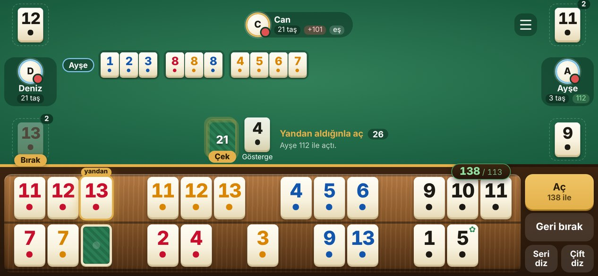
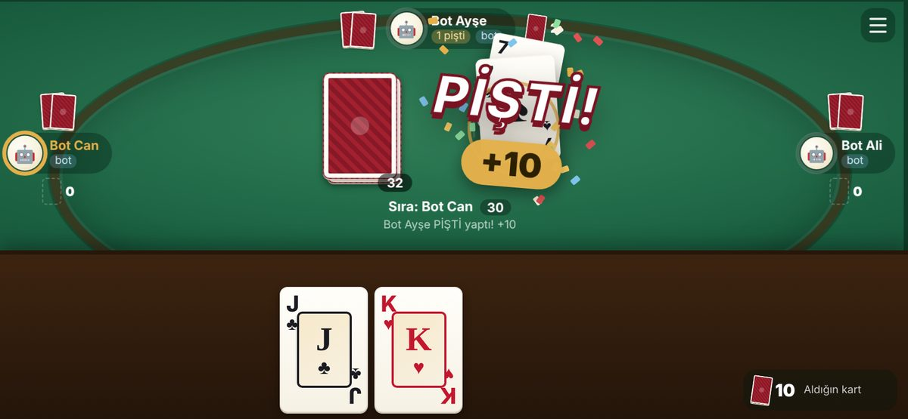
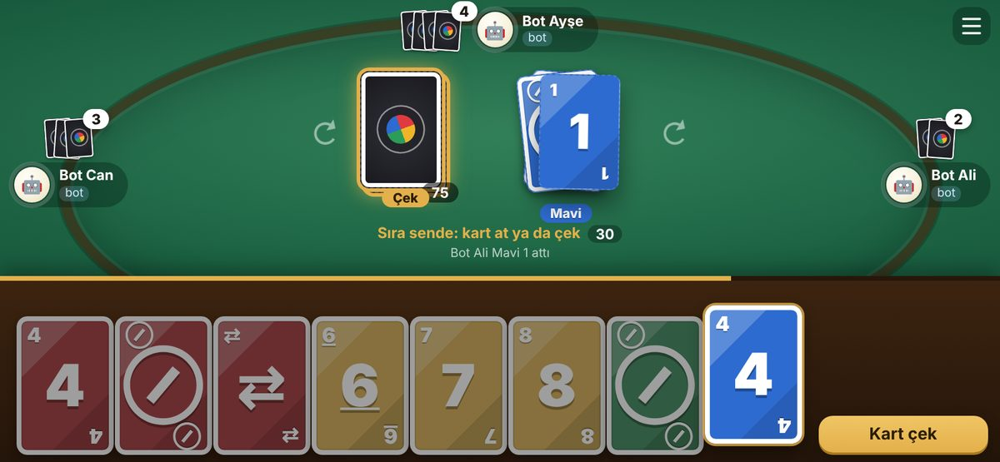

# 101 Okey · Pişti · Uno

Arkadaşlarla telefondan oynanan masa oyunları: **101 Okey**, **Pişti** ve **Uno**. Hangi oyunun oynanacağı ana menüden (lobi) seçilir. Oyunu bir bilgisayar açar (Mac, Windows ya da Linux), herkes telefonundan ya da tabletinden **tarayıcıyla** girer. Telefonlara uygulama kurulmaz; Android, iPhone, tablet ve bilgisayar aynı masada oynar.



| Pişti | Uno |
| --- | --- |
|  |  |

## Özellikler

- **Her ağdan oynanır:** internet linkiyle herkes kendi yerinden girer; biri evin Wi-Fi'ında, biri hotspot'ta, biri mobil veride olabilir. İsterseniz internetsiz, aynı Wi-Fi'dan da oynanır.
- **QR kodla giriş:** bilgisayardaki sayfada çıkan kodu telefon kamerasıyla okutmak yeter.
- **Üç oyun:** ana menüde **101 Okey**, **Pişti** ya da **Uno** seçilir. Pişti ve Uno 2-4 kişiyle, okey 4 kişiyle oynanır.
- **Botlar:** istediğiniz sandalyeye **bot koy** ile bot oturur, botlar kendiliğinden oynar. Sonradan gelen arkadaş bir botun yerine geçer.
- **Karşılıklı masa:** pişti ve uno'da kartlar oval bir masada dağıtılır, atılan kartlar uçarak gider. Pişti yapınca ekrana büyük **PİŞTİ!** yazısı, konfeti ve titreşim gelir; uno'da yön oku, UNO! ve Yakala! düğmeleri var.
- **Oyun modları:** okeyde eşli / eşsiz, katlamalı (eşine katlanmaz), el sayısı; piştide eşli / eşsiz ve hedef puan; uno'da hedef puan ve +2/+4 biriktirme. Hepsinde hamle süresi (20–60 sn ya da süresiz).
- **Kolay ıstaka:** dizili perlerin toplamı ıstakanın köşesinde yazar; yetince tek dokunuşla açılır. "Seri diz" ve "Çift diz" perler arasında boşluk bırakarak dizer. Açtıktan sonra elde kalan puan, sol üstte toplam puanın görünür.
- **İşle düğmesi:** işlenebilen taşlar işaretlenir, tek dokunuşla masaya işlenir; masadaki okey alınabiliyorsa onu da alır.
- **Kopmaya dayanıklı:** telefonun bağlantısı koparsa kendiliğinden yeniden bağlanır. Oyun kapanıp açılsa da kaldığı yerden devam eder.
- **Masa dolu kalmaz:** sayfayı kapatıp giden birinin yeri, masaya oturmadan da **çıkar** ile boşaltılır; lobide 3 dakika bağlı olmayan kendiliğinden kalkar. Oyun sürerken bağlantısı kopanın yerine **bot koy**ulur ya da yeni gelen **yerine geç**er.
- **Kurallar oyunda kontrol edilir:** açış puanı, işleme, okey ve ceza puanları, el sonu hesabı.
- **Kurulum derdi yok:** sadece Node.js gerekir; `npm install` yok, ek paket yok.

## Gereken

- **Oyunu açacak bilgisayarda Node.js** (ücretsiz, bir kere kurulur): [nodejs.org](https://nodejs.org) adresinden **LTS** sürümünü indirip kurun.
- **Oyuncularda sadece bir tarayıcı** (Chrome, Safari, Samsung Internet...).

## Kurulum

**Kolay yol:** bu sayfada yeşil **Code** düğmesi → **Download ZIP**, sonra zip'i açın. Klasörün adı `Okey_101-main` olur.

**Git ile:**

```
git clone https://github.com/AhmetEmreOzumagi/Okey_101.git
cd Okey_101
```

## Başlatma

1. Oyun klasöründe bir terminal açın:
   - **Windows:** klasörü açın, üstteki adres çubuğuna `cmd` yazıp Enter'a basın.
   - **Mac:** Terminal'i açın, `cd ` yazın (sonunda bir boşluk), klasörü Terminal penceresine sürükleyip Enter'a basın.
2. Şunu yazın:

   ```
   node baslat.js link
   ```

3. Bilgisayarda oyun sayfası açılır, birkaç saniye içinde internet linkinin **QR kodu** çıkar. Arkadaşlarınız kodu okutur ya da linki WhatsApp'tan atarsınız.
4. Herkes adını yazıp masada boş bir sandalyeye dokunur. Üstten oyunu (**101 Okey**, **Pişti**, **Uno**) ve ayarları seçin, sonra **Oyunu başlat**. Az kişiyseniz istediğiniz sandalyeye **bot koy** ya da **Boş yerlere bot oturt**.

Pencere açık kaldıkça oyun ve link çalışır. Kapatınca oyun durur; tekrar açınca kaldığı yerden devam eder.

| Komut | Ne zaman |
| --- | --- |
| `node baslat.js link` | **En kolayı.** Herkes her ağdan girer, aynı Wi-Fi şart değil. İnternet gerekir. |
| `node baslat.js` | Herkes aynı Wi-Fi'dayken, internetsiz. Telefonlar bilgisayarın yerel adresine girer (örn. `192.168.1.34:8101`). |

`npm run link` ve `npm start` de aynı işi yapar. Diğer seçenekler: `--port 9000` (başka port), `--tarayici-acma` (bilgisayarda sayfayı açma).

### Çift tıklayarak

Terminal istemeyenler için klasörde hazır dosyalar var:

| | İnternet linkiyle | Aynı Wi-Fi'dan |
| --- | --- | --- |
| **Windows** | `Windows - Internetten Oyna.bat` | `Windows - Oyunu Baslat.bat` |
| **Mac** | `Mac - Internetten Oyna.command` | `Mac - Oyunu Baslat.command` |

Windows'taki dosyalar Node.js kurulu değilse kurmayı da teklif eder. Mac'te **Mac - Guncelle.command** oyunu GitHub'daki en yeni sürüme günceller (oyun kaydı kalır) ve internet linkiyle açar. İnternetten indirilen dosyaları sistem ilk seferde engelleyebilir:

- **Windows** "Windows bilgisayarınızı korudu" derse **Ek bilgi → Yine de çalıştır**; "Yayımcı doğrulanamadı" derse **Çalıştır**.
- **Mac** dosyayı açmazsa klasörde açtığınız terminalde bir kere `xattr -cr . && chmod +x *.command` çalıştırın, ya da doğrudan `node baslat.js link` kullanın.

## Oyun içinde

- Telefonu yan çevirin. Menüden (☰) **Tam ekran** seçilebilir. iPhone'da tam ekran için Safari'de **Paylaş → Ana Ekrana Ekle**, sonra ana ekrandaki simgeden açın.
- **Çekmek:** desteye dokunun ya da soldaki oyuncunun attığı taşa dokunup alın. Yandan aldığınız taşla açamazsanız **Geri bırak**.
- **Dizmek:** taşı sürükleyerek ıstakada yerini değiştirin ya da **Seri diz** / **Çift diz**.
- **Açmak:** ıstakanın sağ üstündeki toplam yetince yeşil olur (ör. `108 / 101`); **Aç**'a basınca dizili perlerin hepsi birden açılır. Açtıktan sonra **İndir** yeni dizdiğiniz perleri masaya koyar.
- **İşlemek:** **İşle** düğmesi (Seri diz'in yanında) işlenebilen bütün taşları kendiliğinden doğru perlere koyar; ıstakada dizili perleriniz İndir için kalır. Tek tek işlemek için taşı masadaki pere sürükleyin ya da taşı seçip pere dokunun. İşlenebilen ya da masadaki okeyi alabilen taşların altında yeşil bir çizgi olur.
- **Masadaki okeyi almak:** okeyin yerine geçen taş sizdeyse onu o pere sürükleyin ya da **İşle**'ye basın; okey elinize gelir. Soldan böyle bir taş gelirse alıp hemen okeyi alabilirsiniz.
- **Atmak:** taşı sağ alttaki **At** kutusuna sürükleyin ya da seçip **At**.
- Okey elinizde de masadaki perlerde de ters (yeşil sırtı görünür) durur; sahte okey sadece ✿ işaretiyle görünür. Ortada sadece gösterge vardır. Kimin elinde kaç taş kaldığı görünmez.
- Süre dolarsa taş otomatik çekilip atılır.
- Telefon kapanırsa sayfayı yenileyin; başka telefona geçtiyseniz aynı adı yazmanız yeterli. Bağlanma adresi ve QR kod menüde (☰) de var.
- **Masa doluysa:** lobide bağlantısı olmayan birinin ya da botun altındaki **çıkar**'a dokunun (masaya oturmadan da olur), boşalan yere oturun. Lobide 3 dakikadır bağlı olmayan zaten kendiliğinden kalkar.
- **Oyun sürerken biri giderse:** menüden (☰) **"… yerine bot koy"** deyin, bot onun eliyle devam eder. Yeni gelen biri adını yazıp bağlantısı kopanın ya da botun altındaki **yerine geç**'e dokunarak onun yerinden oynar.

### Pişti ve Uno'da

- Telefon yan da dik de tutulabilir. Kendi kartlarınız altta, rakipler masanın etrafında oturur.
- **Kart atmak:** karta iki kez dokunun, ya da bir kez dokunup ortadaki yığına dokunun, ya da kartı yukarı, masaya sürükleyin.
- **Uno:** atacak kartınız yoksa desteye ya da **Kart çek**'e dokunun; çektiğiniz kart uyuyorsa atabilir ya da **Pas** diyebilirsiniz. Renk kartında renk seçme penceresi açılır. 2 kart kalınca **UNO!**'ya basın; biri demeyi unutursa **Yakala!** düğmesi çıkar.
- El bitince sonuç tablosu gelir: piştide kart, kart puanı, pişti ve çoğunluk puanları; uno'da herkesin elinde kalan kartlar.

## Okey kuralları

- Herkese 21, başlayana 22 taş dağıtılır. Başlayan çekmeden bir taş atar. Her elden sonra bir sonraki oyuncu başlar.
- **Okey**, göstergenin bir fazlasıdır (gösterge 13 ise okey 1) ve her taşın yerine geçer. İki **sahte okey** ise okey olan taşın kendisi olarak (o renk ve sayı) kullanılır.
- **Seri:** aynı renk, ardışık, en az 3 taş (12-13-1 olmaz). **Grup:** aynı sayı, farklı renk, 3 ya da 4 taş.
- **Açış:** tek seferde en az **101 puanlık** seri/grup ya da en az **5 çift**. Seriyle açan, masada çiftle açan biri varsa çiftlerini de indirebilir; çiftle açan yeni seri kuramaz ama işleyebilir.
- Yandan aldığınız taşı aynı anda açışta ya da işlemede kullanmanız gerekir.
- Açtıktan sonra masadaki bir okeyin yerine geçen taşı koyup okeyi alabilirsiniz (seri ve gruplarda; çiftlerde olmaz). Yandan gelen taşla da olur.
- **Katlamalı** (açıksa): sonra açan, rakibinin açtığından en az 1 fazlasıyla açar; çiftte de 1 çift fazla gerekir. **Eşine katlanmaz:** siz 130 açtıysanız eşiniz yine 101 ile açabilir.
- **Eşli** (açıksa): karşılıklı oturanlar eştir. Biri bitince eşinin el cezası silinir. Puanlar takım olarak toplanır.
- Okey atmak ya da masadaki bir pere işlenebilecek taşı atmak: **+101 ceza**.
- **El sonu:** biten -101 alır. Açanlar elde kalan taşların toplamını, çiftle açanlar iki katını, hiç açmayanlar 202 yazar. Okey atarak ya da çiftten bitilirse herkesin puanı iki katına çıkar. Kimse açmadan tek seferde tüm elini indirip biten -202 alır, diğerleri 404 yazar.
- Ortada taş kalmayınca son taşı çeken oyuncu taşını atar atmaz el biter (sıradaki yandan alamaz). Açanlar elinde kalan taşların toplamını, çiftle açanlar iki katını, açmayanlar 202 yazar; elde kalan okey 101 sayılır.
- Seçilen el sayısı bitince toplamı **en düşük** olan (eşlide en düşük takım) kazanır.

## Pişti kuralları

- 52'lik desteyle 2-4 kişi oynanır (4 kişide eşli de olur: karşılıklı oturanlar eş). Ortaya 4 kart konur, 3'ü kapalı, en üstteki açık (açık kart vale olmaz). Herkese 4'er kart dağıtılır; eller bitince deste bitene kadar 4'er kart daha dağıtılır.
- Sırayla birer kart atılır. Atılan kart yerdeki en üst kartla **aynı değerdeyse** yerdeki bütün kartlar alınır. **Vale (J)** ile her zaman yerdeki bütün kartlar alınır.
- **Pişti:** yerde tek kart varken onu aynı değerdeki kartla almak: **10 puan**. Yerdeki **As** ile pişti **20**, **Vale** ile pişti **30** puan. Tek karta vale atmak pişti sayılmaz; elin en son kartıyla yapılan pişti de sayılmaz.
- **Kart puanları:** her As 1, her Vale 1, sinek ikili 2, karo onlu 3 puan. En çok kartı alan (eşlide takım) 3 puan daha alır; eşitlikte kimse almaz.
- Deste ve eller bitince yerde kalan kartlar en son kart alana gider.
- Seçilen hedef puana (51, 101 ya da 151) ilk ulaşan kazanır. Aynı elde birden çok kişi geçerse en yüksek puanlı kazanır; puanlar eşitse bir el daha oynanır.

## Uno kuralları

- 108 kartlık Uno destesiyle 2-4 kişi oynanır: her renkte (kırmızı, sarı, yeşil, mavi) bir 0, ikişer 1-9, ikişer **Pas** (⊘), **Yön** (⇄) ve **+2**; ayrıca 4 **renk kartı** ve 4 **+4**. Herkese 7 kart dağıtılır.
- Yerdeki kartla **aynı renkte**, **aynı sayıda** ya da **aynı işarette** bir kart atılır. Renk kartı ve +4 her zaman atılır, atan rengi seçer.
- Atacak kart yoksa desteden bir kart çekilir; çekilen kart uyuyorsa hemen atılabilir, yoksa sıra geçer.
- **Pas:** sıradaki atlanır. **Yön:** yön değişir (iki kişide pas gibi). **+2:** sıradaki 2 kart çeker, sırası geçer. **+4:** sıradaki 4 kart çeker, sırası geçer.
- **Biriktirme** (ayarlardan açılırsa): +2 gelen +2 ya da +4 atıp cezayı büyütüp sıradakine aktarabilir; +4 üstüne +4 atılır. Karşılık veremeyen toplamı çeker.
- 2 kartı kalan **UNO!** der. Demeden 1 karta inen, sıradaki oyuncu oynamadan önce biri **Yakala!** derse 2 kart çeker. Botlar da yakalar.
- Elini ilk bitiren, rakiplerin elinde kalan kartların puanını alır: sayılar kendi değeri, Pas/Yön/+2 20, renk kartı ve +4 50 puan. Hedef puana (100, 200, 300 ya da 500) ilk ulaşan kazanır.

## İnternet linki nasıl çalışıyor?

`link` modu Cloudflare'in ücretsiz, hesap gerektirmeyen geçici tünelini kullanır. Bağlantı aracı (`cloudflared`, yaklaşık 20 MB) ilk seferde oyun klasöründeki `bin/` içine iner; bilgisayara bir şey kurulmaz. Araç inmezse ya da Cloudflare cevap vermezse başlatıcı kendiliğinden **localhost.run** (ssh) yedeğine geçer.

- Link her açılışta yenidir (`https://...trycloudflare.com`). Bağlantı koparsa yeniden bağlanır; link değişirse oyun sayfasındaki QR da değişir, oyuncular yeni linke girip aynı adı yazar.
- Oyunu açan herkes kendi linkini alır; kimse başkasının bilgisayarına bağlanmaz.
- Linki bilen herkes masaya oturabilir; sadece arkadaşlarınızla paylaşın.
- Oyun çok az veri harcar.

## Sorun çıkarsa

- **`node` tanınmıyor / bulunamadı:** Node.js'i kurun, terminali kapatıp yeniden açın.
- **Aynı Wi-Fi'da bazı telefonlar giremiyor:** telefon hotspot'ları, yurt/okul/kafe ağları ve modemlerin misafir ağları cihazları birbirinden ayırır. `node baslat.js link` ile girin.
- **Windows'ta telefonlar yerel adrese giremiyor:** Güvenlik Duvarı sorduysa "Erişime izin ver" deyin; Wi-Fi ağ profili **Özel ağ** olmalı (Ayarlar → Ağ ve internet → Wi-Fi).
- **Link açılmıyor:** internet bağlantısını kontrol edin. Sürmezse `bin` klasörünü silip yeniden başlatın (araç yeniden iner).
- **Port dolu:** `node baslat.js link --port 9000`
- **Bağlantı sık kopuyor:** oyun açıkken bilgisayar uyumaz (Mac ve Windows), ama dizüstünün kapağını kapatmayın.

Daha ayrıntılı Türkçe kılavuz: [NASIL OYNANIR.txt](NASIL%20OYNANIR.txt)

## Geliştirenler için

| Dosya | Ne işe yarar |
| --- | --- |
| `baslat.js` | Başlatıcı: oyunu açar, `link` ile tüneli kurar, bilgisayarın uyumasını engeller |
| `server.js` | HTTP sunucusu; anlık güncellemeler SSE ile, kesilirse yoklama ile |
| `game.js` | Masa, lobi, oyun seçimi, sıra, süre; okeyin açış/işleme/ceza ve puan hesabı (bütün kurallar sunucuda) |
| `pisti.js` | Pişti: dağıtım, alma, pişti ve kart puanları, eşli oyun, pişti botu |
| `uno.js` | Uno: deste, Pas/Yön/+2/+4, biriktirme, UNO deme ve yakalama, puanlama, uno botu |
| `lib.js` | Oyunların ortak yardımcıları (karıştırma, sıra, süre, kayıt) |
| `bot.js` | Boş koltuklar için bilgisayar oyuncusu (okey) ve kart oyunlarında botların zamanlaması |
| `public/engine.js` | Taş, seri/grup/çift kontrolü ve ıstaka dizme (sunucu ve telefon ortak kullanır) |
| `public/` | Telefonlarda açılan tek sayfalık arayüz (`app.js`, `cards.js` pişti/uno masası, `style.css`, `qr.js`) |
| `tests/` | Okey, pişti ve uno kural testleri, botlarla tam oyunlar, 200 oyunluk simülasyon ve HTTP testi |

```
npm test
```

Sadece Node'un kendi modülleri kullanılır. Oyun sırasında oluşan `oyun-kaydi.json`, `internet-linki.txt` ve `bin/` depoya girmez (`.gitignore`).
